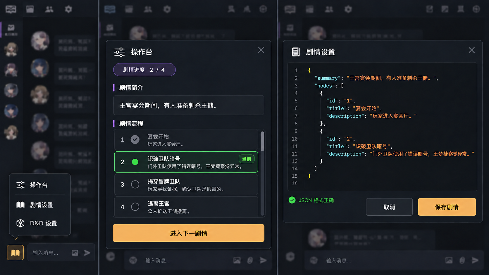

# SillyTavern 手动剧情流程设计

> 状态：已确认设计。本文只设计“剧情 JSON 编辑、当前节点推进、角色上下文注入”，不包含演员调度和 AI 导演。

## 1. 目标

插件维护完整剧情，导演可以查看全部节点；AI 角色每次生成时只能看到：

- 剧情简介；
- 已完成节点；
- 当前节点。

未来节点不得进入发给 AI 角色的上下文，避免角色自行提前推进剧情。

角色卡只描述角色，世界书只描述世界和规则，具体剧情只保存在插件中。

## 2. 剧情 JSON

用户通过纯文本编辑器直接编辑 JSON：

```json
{
  "summary": "王宫宴会期间，有人准备刺杀王储。玩家需要找出幕后主使，并护送王储安全离开王宫。",
  "nodes": [
    {
      "id": "1",
      "title": "宴会开始",
      "description": "玩家进入宴会厅，接触王储和王室成员。"
    },
    {
      "id": "2",
      "title": "识破卫队暗号",
      "description": "门外卫队使用了错误暗号，王梦捷察觉异常。"
    },
    {
      "id": "3",
      "title": "揭穿冒牌卫队",
      "description": "玩家寻找证据，确认卫队是假冒的。"
    }
  ]
}
```

`id` 用于插件稳定识别节点。当前节点不写入用户编辑的 JSON，由插件单独维护。

保存时验证：

- `summary` 是非空字符串；
- `nodes` 至少包含一个节点；
- 每个节点都有唯一的 `id`、非空 `title` 和非空 `description`；
- JSON 中不接受 `status`，状态由插件根据当前节点计算。

## 3. 入口菜单与窗口组织

底部书本图标是命运账本的统一入口。点击后在图标上方显示单层菜单：

```text
操作台
────────
剧情设置
D&D 设置
```

- **操作台**放在首项，是日常高频操作入口；
- 分割线下方放各个独立设置入口；
- 第一版只定义**剧情设置**的内容，操作台和 D&D 设置由各自设计文档补充；
- 不使用二级菜单，也不先打开首页再选择功能；
- 点击菜单项后关闭菜单并打开对应窗口，点击外部或按 `Esc` 只关闭菜单。

各页面视觉上是独立窗口，技术上共用同一个 Popup 外壳，只替换内部内容。以后增加设置项时，只需在分割线下新增入口。

## 4. 操作台与剧情设置

### 操作台

操作台是日常核心操作区。本设计只确定其中的剧情进度模块：

- 当前进度，例如 `2 / 3`；
- 剧情简介；
- 固定高度、内部滚动的剧情流程列表，按顺序显示全部节点；
- 已完成节点置灰并显示完成标记；
- 当前节点突出显示并标记为“当前”；
- 未来节点正常显示，供人类导演掌握完整流程；
- **进入下一剧情**按钮。

打开操作台或推进节点后，列表自动将当前节点滚动到可见区域。**进入下一剧情**按钮固定在列表下方，不随列表滚动。

操作台不提供**编辑剧情**按钮。完整流程只显示给人类导演；发送给 AI 角色的内容仍严格遵守第 7 节，只包含剧情简介、已完成节点和当前节点。公开旁白、演员选择、隐藏指令、执行状态和以后增加的骰子功能，也放在操作台中，但由各自设计继续补充。

### 剧情设置

剧情设置是独立设置窗口，包含：

- JSON 文本编辑器；
- JSON 格式与字段验证结果；
- **保存剧情**和**取消**按钮。

第一版不提供节点表格、拖拽排序、分支图或表单式节点编辑。首次保存有效 JSON 后，第一个节点自动成为当前节点。再次保存时，如果原当前节点的 `id` 仍存在，则保持当前节点；如果已经被删除，则回到第一个节点并提示用户。

界面设计图：



## 5. 节点推进

插件单独保存 `currentNodeId`。点击 **进入下一剧情** 时：

1. 找到当前节点在 `nodes` 中的位置；
2. 将 `currentNodeId` 改为下一个节点的 `id`；
3. 保存聊天元数据；
4. 更新当前节点显示和后续生成使用的隐藏上下文。

到达最后一个节点后，按钮禁用并显示“已到最后节点”。第一版不自动推进，也不提供回退按钮。

## 6. 保存位置

完整剧情和当前节点保存在当前 SillyTavern 聊天的 metadata 中：

```json
{
  "st_fate_ledger": {
    "version": 1,
    "plot": {
      "summary": "...",
      "nodes": []
    },
    "currentNodeId": "1"
  }
}
```

插件始终从 `SillyTavern.getContext().chatMetadata` 获取当前聊天数据，并通过 `saveMetadata()` 持久化。切换或新建聊天时重新读取，不长期缓存 metadata 引用。

## 7. 发给 AI 角色的内容

每次生成前，插件根据 `currentNodeId` 临时构造角色可见的剧情上下文。

例如当前节点为 `2`：

```json
{
  "summary": "王宫宴会期间，有人准备刺杀王储。玩家需要找出幕后主使，并护送王储安全离开王宫。",
  "nodes": [
    {
      "title": "宴会开始",
      "description": "玩家进入宴会厅，接触王储和王室成员。",
      "status": "completed"
    },
    {
      "title": "识破卫队暗号",
      "description": "门外卫队使用了错误暗号，王梦捷察觉异常。",
      "status": "active"
    }
  ]
}
```

构造规则：

- 当前节点之前的节点标记为 `completed`；
- 当前节点标记为 `active`；
- 当前节点之后的节点不复制、不序列化、不注入；
- 插件内部的完整 JSON 不得传给角色生成接口。

该 JSON 通过 SillyTavern 的生成前 Prompt Interceptor 作为临时系统上下文注入。它不创建聊天消息，不显示给用户，也不修改角色卡或世界书。

## 8. 数据流

```text
用户编辑完整 JSON
        ↓
验证并保存到当前聊天 metadata
        ↓
插件维护 currentNodeId
        ↓
每次角色生成前截取“过去节点 + 当前节点”
        ↓
临时注入 AI 请求
```

**进入下一剧情**只修改 `currentNodeId`。它不会生成消息，也不会自动触发角色回复。

## 9. 错误处理

- JSON 语法错误：不保存，显示解析错误位置，保留文本框内容；
- 字段缺失或节点 `id` 重复：不保存，指出具体节点；
- 当前节点不存在：阻止生成，并要求重新保存剧情；
- 保存 metadata 失败：保持原状态，不更新界面中的当前节点；
- 切换聊天：关闭未保存的编辑内容，加载目标聊天自己的剧情状态。

## 10. 测试重点

1. 有效 JSON 可以保存，无效 JSON 不覆盖原数据；
2. 推进后，原当前节点变为 `completed`，下一节点变为 `active`；
3. 角色上下文中永远不存在未来节点的标题或简介；
4. 到达最后节点后不能继续推进；
5. 不同聊天的剧情和当前节点互不影响。

## 11. 第一版不做

- Markdown 剧情格式；
- 可视化节点编辑器；
- 分支剧情；
- 自动推进或 AI 选择节点；
- 修改角色卡、世界书或聊天记录；
- 向 AI 角色发送未来节点。

## 12. SillyTavern 接口依据

- [UI Extensions：Chat metadata 与 Prompt Interceptors](https://docs.sillytavern.app/for-contributors/writing-extensions/)
- [SillyTavern `ChatMetadata` 类型](https://github.com/SillyTavern/SillyTavern/blob/release/public/global.d.ts)
